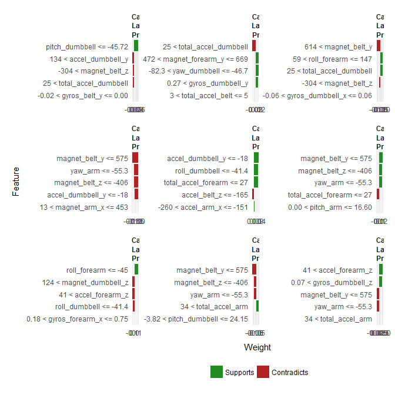

## Classifying Movements based on Accelerometer Data 

The objective of this project was to develop a model that can accurately predict out-of-sample whether a movement belonds to one of five classes. My approach included tidying the data, setting up training controls and hyperparameter searches, and cross-validating the results to estimate the out-of-sample accuracy, as well as holding out a test set. Data for this project came from the [Human Activity Recognition project from Groupware@LES](http://groupware.les.inf.puc-rio.br/har). The repository for all the project files is available on [GitHub](https://github.com/asherzafar/coursera-practical-machine-learning).

#### Update - Jan 3, 2018
I came back to this project to try out a few things beyond the tree ensembles that were used, namely:

* The [LIME](https://github.com/thomasp85/lime) package for model interpretability
* A multilayer perceptron neural net
* Principal Component Analysis
* A Gaussian Process model, though that didn't go so well with compute power!

These results are available in the Appendix. Full code is available in the model.R file in this repo.

### Exploring the data
While there are 159 variables in the data set, only 53 had useful data in them (most were almost entirely blank and near zero variance). Metadata on specific users was dropped, as this might not be available for any future movements that are predicted. The remaining data was used to train 4 models. 70% of the data was used for training, and 3 fold cross-validation was used on this set (more folds or repeated CV would have been of little value for the computational time involved). Example code from the random forest (RF) model is presented below. Only selected code is in this markdown file. Full code for this assignment is available within this repo in the [model.R](https://github.com/asherzafar/coursera-practical-machine-learning/blob/master/model.R) file.

### Random Forest Model Code

```r
control <- trainControl(method="cv", number=3, summaryFunction = multiClassSummary, classProbs = TRUE) #Set controls
date() #Timestamp to view how long the model took to run
train.rf <- train(classe ~ ., data=train.m, method="rf", metric=metric, trControl=control, tuneLength=5) #Run model with controls and hyperparameter search. Metric was set to "Accuracy"
print(train.rf) #Print model results
plot(train.rf) #Plot accuracy under different hypertuning parameters
date()
```

### Model Comparison

The most accurate cross-validated random forest model with the hyperparameter mtry=14 (the number of sampled variables per split) was over 99% accurate. The only comparable model in performance were gradient boosted trees (GBT), though I also tested a single decision tree and linear SVM. Cross-validation folds had little variance in accuracy or AUC. Softmax regression was considered but not used given the performance of the tree ensembles.


Applying the results to the held-out test data validate the expectations from the cross-validation. Both the RF and GBM were over 99% accurate. Confusion matrices indicated little pattern in errors, though some misclassifications were slightly higher than others.

### Random Forest Results


```
## Confusion Matrix and Statistics
## 
##           Reference
## Prediction    A    B    C    D    E
##          A 1673    5    0    0    0
##          B    0 1133    8    0    0
##          C    0    1 1018   13    0
##          D    0    0    0  950    1
##          E    0    0    0    1 1081
## 
## Overall Statistics
##                                           
##                Accuracy : 0.9951          
##                  95% CI : (0.9929, 0.9967)
##     No Information Rate : 0.2843          
##     P-Value [Acc > NIR] : < 2.2e-16       
##                                           
##                   Kappa : 0.9938          
##  Mcnemar's Test P-Value : NA              
## 
## Statistics by Class:
## 
##                      Class: A Class: B Class: C Class: D Class: E
## Sensitivity            1.0000   0.9947   0.9922   0.9855   0.9991
## Specificity            0.9988   0.9983   0.9971   0.9998   0.9998
## Pos Pred Value         0.9970   0.9930   0.9864   0.9989   0.9991
## Neg Pred Value         1.0000   0.9987   0.9984   0.9972   0.9998
## Prevalence             0.2843   0.1936   0.1744   0.1638   0.1839
## Detection Rate         0.2843   0.1926   0.1730   0.1615   0.1837
## Detection Prevalence   0.2852   0.1939   0.1754   0.1616   0.1839
## Balanced Accuracy      0.9994   0.9965   0.9947   0.9926   0.9994
```

### Gradient Boosted Tree Results


```
## Confusion Matrix and Statistics
## 
##           Reference
## Prediction    A    B    C    D    E
##          A 1668    6    0    0    0
##          B    5 1123   10    0    5
##          C    0    6 1010   17    4
##          D    0    0    6  946    8
##          E    0    4    0    1 1065
## 
## Overall Statistics
##                                           
##                Accuracy : 0.9878          
##                  95% CI : (0.9846, 0.9904)
##     No Information Rate : 0.2843          
##     P-Value [Acc > NIR] : < 2.2e-16       
##                                           
##                   Kappa : 0.9845          
##  Mcnemar's Test P-Value : NA              
## 
## Statistics by Class:
## 
##                      Class: A Class: B Class: C Class: D Class: E
## Sensitivity            0.9970   0.9860   0.9844   0.9813   0.9843
## Specificity            0.9986   0.9958   0.9944   0.9972   0.9990
## Pos Pred Value         0.9964   0.9825   0.9740   0.9854   0.9953
## Neg Pred Value         0.9988   0.9966   0.9967   0.9963   0.9965
## Prevalence             0.2843   0.1936   0.1744   0.1638   0.1839
## Detection Rate         0.2835   0.1909   0.1717   0.1608   0.1810
## Detection Prevalence   0.2845   0.1943   0.1762   0.1632   0.1818
## Balanced Accuracy      0.9978   0.9909   0.9894   0.9892   0.9916
```

Based on these results, I predict the 20 entries held out for the "quiz" component of the assignment. Both models agree on the results for these 20 entries.


```
##  [1] B A B A A E D B A A B C B A E E A B B B
## Levels: A B C D E
```

### Conclusions

Either the random forest or gradient boosted tree models on theiur own would be more than suitable for this problem, with both achieving over 99% accuracy. Hyperparameters can be refined further and tested for compute time under parallel processing to determine the best model for an operational or real-time prediction setting.

## Appendix - Jan 3, 2018
### LIME
Out of curiousity, I wanted to try out the increasingly popular [LIME](https://github.com/thomasp85/lime) package. LIME stands for "Local Interpretable Model-agnostic Explanations", and, in a nutshell, will evaluate specific predictions of an observation in your model, and indicate which features most strongly supported or contradicted that prediction locally. It has hefty compute time, so I just tried it on three points from the random forest model for now. I anticipate this being useful for most of my projects.


Forgive the... "lack of polish" in the stock graph above. Interpreting this is still a little challenging, but we can see some feature weights that were important to specific predictions, such as forearm or belt movement.

### Multilayer Perceptron Neural Net and LIME
For fun, I tried this on a multilayer perceptron (MLP) to 1) see if a neural net could achieve similar accuracy, and 2) see if LIME interprets results differently. I attempted a Gaussian Process model as well, but given that it's O(n^3) complexity, it didn't do so great on my desktop past 2,000 observations.


```
## Multi-Layer Perceptron, with multiple layers 
## 
## 13737 samples
##    52 predictor
##     5 classes: 'A', 'B', 'C', 'D', 'E' 
## 
## Pre-processing: centered (52), scaled (52), nearest neighbor
##  imputation (52), principal component signal extraction (52) 
## Resampling: Cross-Validated (3 fold) 
## Summary of sample sizes: 9157, 9158, 9159 
## Resampling results:
## 
##   logLoss    AUC      prAUC      Accuracy   Kappa      Mean_F1  
##   0.2450007  0.99157  0.9745527  0.9462045  0.9319775  0.9429589
##   Mean_Sensitivity  Mean_Specificity  Mean_Pos_Pred_Value
##   0.9434405         0.9866527         0.942756           
##   Mean_Neg_Pred_Value  Mean_Precision  Mean_Recall  Mean_Detection_Rate
##   0.9865836            0.942756        0.9434405    0.1892409          
##   Mean_Balanced_Accuracy
##   0.9650466             
## 
## Tuning parameter 'layer1' was held constant at a value of 50
## 
## Tuning parameter 'layer2' was held constant at a value of 50
## 
## Tuning parameter 'layer3' was held constant at a value of 50
```

This particular configuration achieved 94.6% accuracy on scaled, nn-imputed, and PCA processed data (normally I'd search through neuron configurations and compare preProcessing techniques). The MLP also seems to have emphasized different movements, too, though other configurations I tested delivered different LIME results.



### Principal Component Analysis
I wish I took a look at the PCA biplot when I first did this, because the five classes of movement in the training data are actually quite clear from the first 2 PCAs alone (though they don't explain a ton of the variance), and surely a decently configured k-means clustering would do a decent job here. I might also have considered t-SNE to capture non-linearity for comparison.


As mentioned above, it took a large number of principal components to explain the variance, but I'm curious how some of the models above might have performed on PCA reduced data. These findings are consistent with what we know about this movement data. There are many movements being tracked, and thus noise, but we would also expect clear sets of features to be correlated as part of any larger body movements that are occuring.


